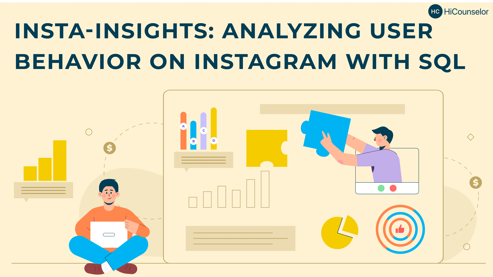

# Data Analysis Project On Instagram: 

***

## Introduction

Instagram is one of the most popular social media platforms in the world, with millions of active users sharing photos, videos, and comments every day. By analyzing the data in these CSV files, we can gain insights into how people use Instagram and how they interact with each other.

Instagram Analytics project is an exciting opportunity to work with data related to one of the most popular social media platforms in the world. By applying our knowledge of __SQL__ and data analysis, we can gain insights into user behavior on Instagram and help businesses and individuals to achieve greater success on the platform.

The aim of this project is to exhibit my data cleaning on __python__ and buliding __SQL__ queries skills on _Instagram User Behaviour_ dataset. 

## Data Source 
I have used the data available at HiCounselor website (_[Live data challenge, 2023](https://hicounselor.com/projects/analysing-user-behaviour-on-instagram-using-python-and-sql)_). The dataset fulfils the requirements for the project and is in the CSV format.

## Problem Statement

The project issues are divided into 2 modules. 

__#Module 1:__ Data Pre-processing on **Python**.

1.  Data cleaning by removing unwanted columns and renaming appropriate columns for improved analysis 
    - comments
    - follows
    - likes
    - photos
    - photo_tags
    - tags
    - users
 2. Generating tables using the cleaned dataset
   
__#Module 2:__ Data Analysing using **SQL**.

1. Find the 5 oldest users.
2. What day of the week do most users register on?
3. To target our inactive users with an email campaign. Find the users who have never posted a photo.
4. Who won the new contest to see who can get the most likes on a single photo?
5. How many times does the average user post? 
6. What is the user ranking by postings higher to lower?
7. Total posts by users.
8. Total numbers of users who have posted at least one time
9. A brand wants to know which hashtags to use in a post. What are the top 5 most commonly used hashtags?
10. We have a small problem with bots on our site. Find users who have liked every single photo on the site?
11. We also have a problem with celebrities. Find users who have never commented on a photo?
12. Are we overrun with bots and celebrity accounts? Find the percentage of our users who have either never commented on a photo or have commented on every photo?
13. Find users who have ever commented on a photo?
14. Are we overrun with bots and celebrity accounts? Find the percentage of our users who have either never commented on a photo or have commented on photos before.

## Data Analysis Concepts/Skills Demonstrated 

1.  Descriptive Analysis
2.  Labelling the data
3.  Sentiment Analysis
    - Valance Shifter
    - Identifying the outliers
    - Confusion Matix (accuracy measurement)
4.  Data Trasnformation for Topic modelling
5.  Topic modelling 
    - Term document matrix
    - N-grams
    - Weighted document-term matrix
    - Latent Semantic Analysis (LSA)

## Findings & Recommendations 

### Findings
The study shows the factors for consumer dissatisfaction are:
1.  **Fittings & Tech issues:** The product is not the kind of product that will fit for everyone, and consumers have higher expectations in terms of technology (Bluetooth) support.
2.  **Delivery Time:** Even while this might not directly relate to Ptron Intunes, it is having an impact on their clientele.
3.  **Material Quality:** This is yet another source of dissatisfaction to consider. However, there are situations when offering excellent materials and designs at a low cost is difficult.

The study shows the factors for consumer satisfaction are:
1.  **Sound Quality:** The majority of good evaluations are due to how satisfied people are with the sound quality (super, impress, fantastic).
2.  **Lightweight:** This brand of earphone is well-liked by its clientele because of how lightweight they are.
3.  **Noise Cancellation and Battery life:** Both the noise canceling feature and the lengthy battery life are reasons why many favor this device. The fact that this product has a dedicated noise canceling button makes it worthwhile to purchase.
4.  **Pricing:** According to the consumer, the product's price is reasonable given its qualities.

### Recommendations
-   The PTron Intunes should resolve the technical problems and create a universally applicable design. 
-   For the benefit of customers seeking a premium appearance, they may also bring another product under this name.

***
